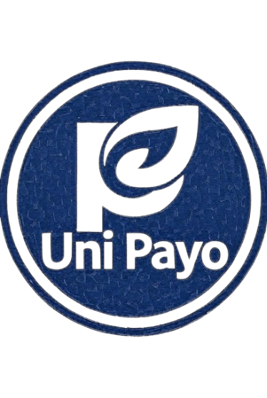

# Sarrera

Ongi etorri **Erronka1** dokumentaziora. Erronka honen helburua enpresa baten IT sistemen diseinua eta horien ezarpen mugatua egitea da.

Gure enpresa Uni-Payo izena du, eta gure zerbitzua Informatikako unibertsitate bat da. Unibertsitatea Eibaren kokatuta dago eta Uni-Eibaren edo beste edozein ikastetxe batean egiten den IT sistemen diseinua egitea planteatu dugu, noski, tamaina ez du zerikusirik, gurea askoz txikiagoa da, irakasle eta ikasle kopuru txikiagoarekin, ekipo gutxiagorekin...

Erronka egiteko ikasgai guztietan ikasitakoa proban jarri beharko dugu. Horretarako, Git-hub eta GitBook erabiliko ditugu errubrikan eskatutakoa azaltzeko eta dokumentatzeko.

<figure><figcaption></figcaption></figure>
