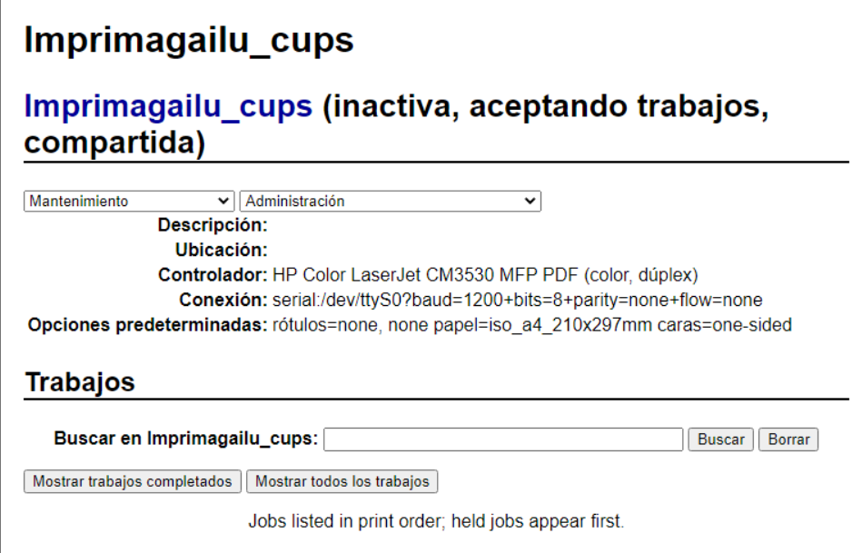

# Wordpress instalatu

-**Wordpress Ubuntun**

* **DB:**

CREATE DATABASE unipayo\_wp;

CREATE USER 'uni\_admin'@'localhost' IDENTIFIED BY 'PayoServer';

GRANT ALL PRIVILEGES ON unipayo\_wp.\* TO 'uni\_admin'@'localhost';

FLUSH PRIVILEGES;

EXIT;

* **Apache2 eta PHP instalatu:**

sudo apt install apache2 php php-mysql php-gd php-mbstring php-xml php-curl libapache2-mod-php -y

sudo systemctl enable apache2

sudo systemctl start apache2

sudo systemctl status apache2

<figure><figcaption></figcaption></figure>

Bezeroan: [http://192.168.10.12](http://192.168.10.12)\

.png>)

* **Wordpress instalatu:**

wget [https://wordpress.org/latest.tar.gz](https://wordpress.org/latest.tar.gz)

tar -xvzf [latest.tar.gz](http://latest.tar.gz)

sudo mv wordpress /var/www/html/wordpress

sudo chown -R www-data:www-data /var/www/html/wordpress

sudo chmod -R 755 /var/www/html/wordpress

sudo a2enmod rewrite

sudo systemctl restart apache2\

Bezeroan: [http://192.168.10.12/wordpress](http://192.168.10.12/wordpress) \

<figure><figcaption></figcaption></figure>

* **Wordpress konfiguratu:**

<figure><figcaption></figcaption></figure>

**-Wordpress Localean**

* **DB sortu MariaDBn.**
* **XAMPP instalatu eta Apache marchan jarri:**

<figure><figcaption></figcaption></figure>

* **Wordpress deskargatu eta C:\xampp\htdocs barruan sartu.**

[https://localhost/wordpres](https://localhost/wordpres)

<figure><figcaption></figcaption></figure>

\
